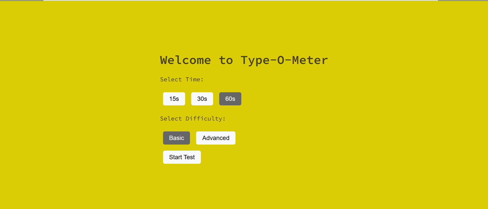
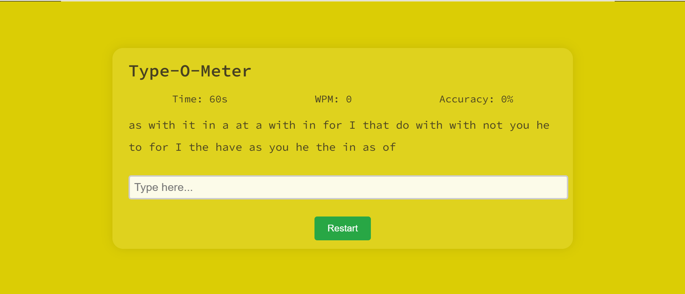
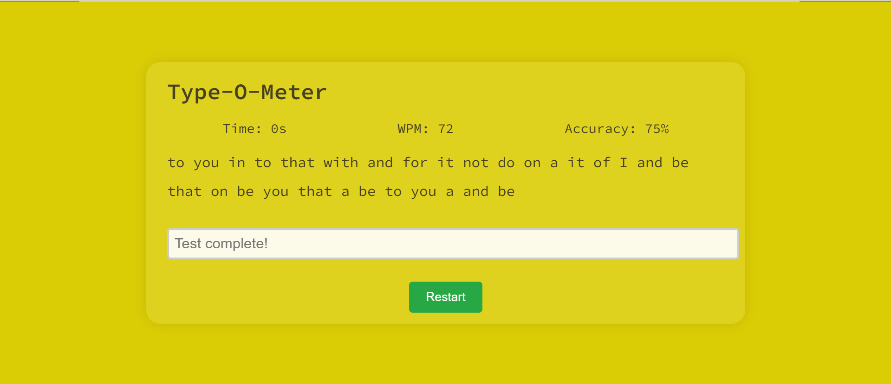

# 🖋️ Type-O-Meter

🔗 **Live Demo:** [Click here](https://typeometer-kousthub-tejas.vercel.app)  to see Live Demo of Our Project

**Type-O-Meter** is a web-based typing speed and accuracy tester built using **React.js**, **HTML**, and **CSS**. It allows users to test their typing skills by selecting a time duration and difficulty level. The app provides real-time statistics including WPM (Words Per Minute), accuracy percentage, and total words submitted.

This project was developed as part of my **Web Programming** course.

---

## 🚀 Tech Stack

- **React.js** – JavaScript library for building user interfaces  
- **HTML** – Markup language for structuring the content  
- **CSS** – Styling the layout and visuals of the app  

---

## 🛠️ How to Clone and Run This Project

You can run this project locally by following these steps:

### 1. Clone the repository

```bash
git clone https://github.com/kousthub-eswar/type-o-meter
```

### 2. Navigate into the project directory

```bash
cd type-o-meter
```

### 3. Install dependencies

Make sure **Node.js** and **npm** are installed on your machine. Then run:

```bash
npm install
```

### 4. Start the development server

```bash
npm start
```

The application will open in your default browser at:

```
http://localhost:3000
```

---

## 📸 Screenshots

Landing Page


Test Page


Result Page


---

## 📄 License

This project is open-source and available for educational and personal use.

---

> Made with ❤️ by Kousthub & Tejas
